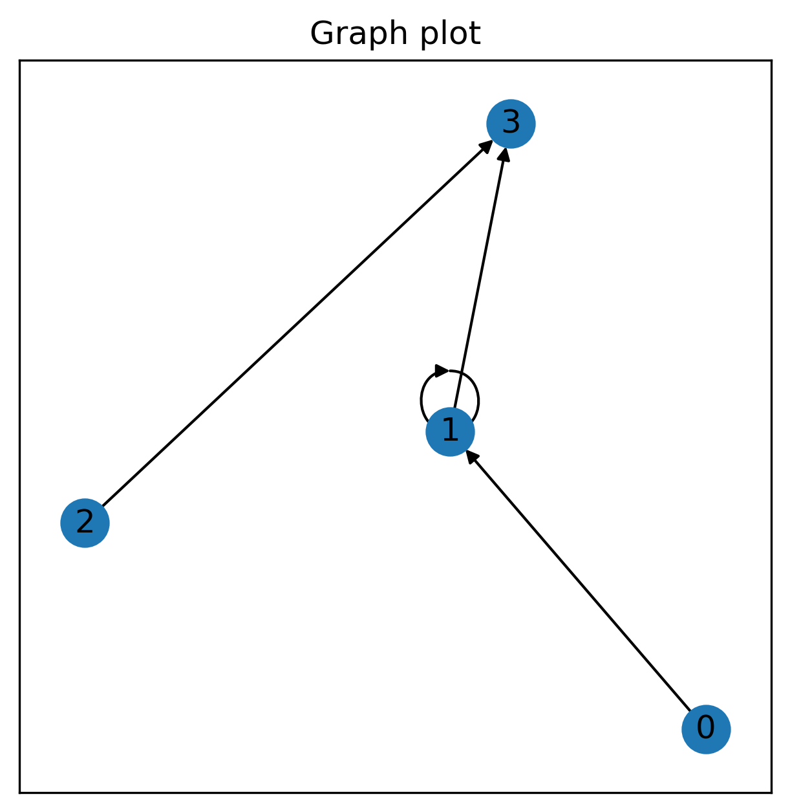
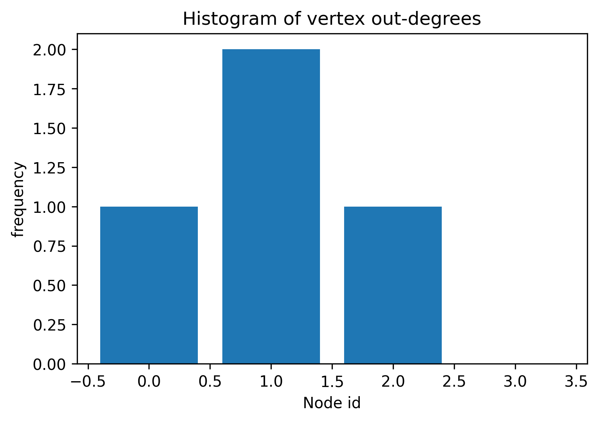

# Ailly homework

## Getting Started

You will need poetry.
```bash
brew install poetry
```
Now you can install the python depedencies
```bash
poetry install
```
You can run the unittests with 
```bash
make tests
```
## See the class in action

See the example in the notebook
```bash
make notebook
```
And open the `example.ipynb`

## Example
Graph generated with my class

Histogram of vertex out-degrees

